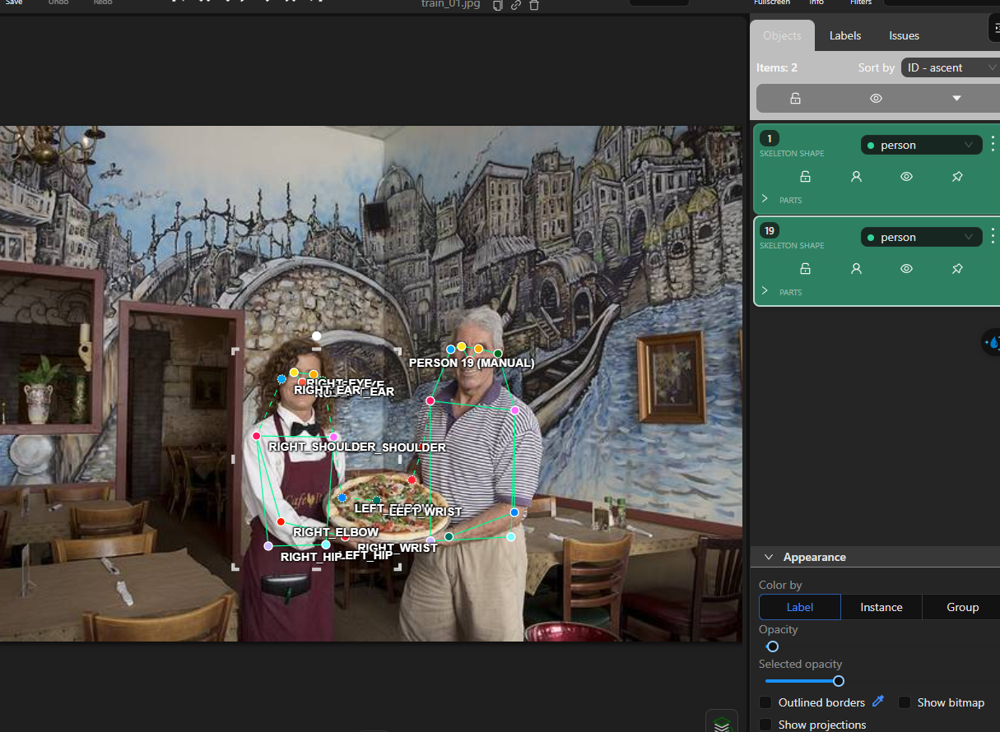
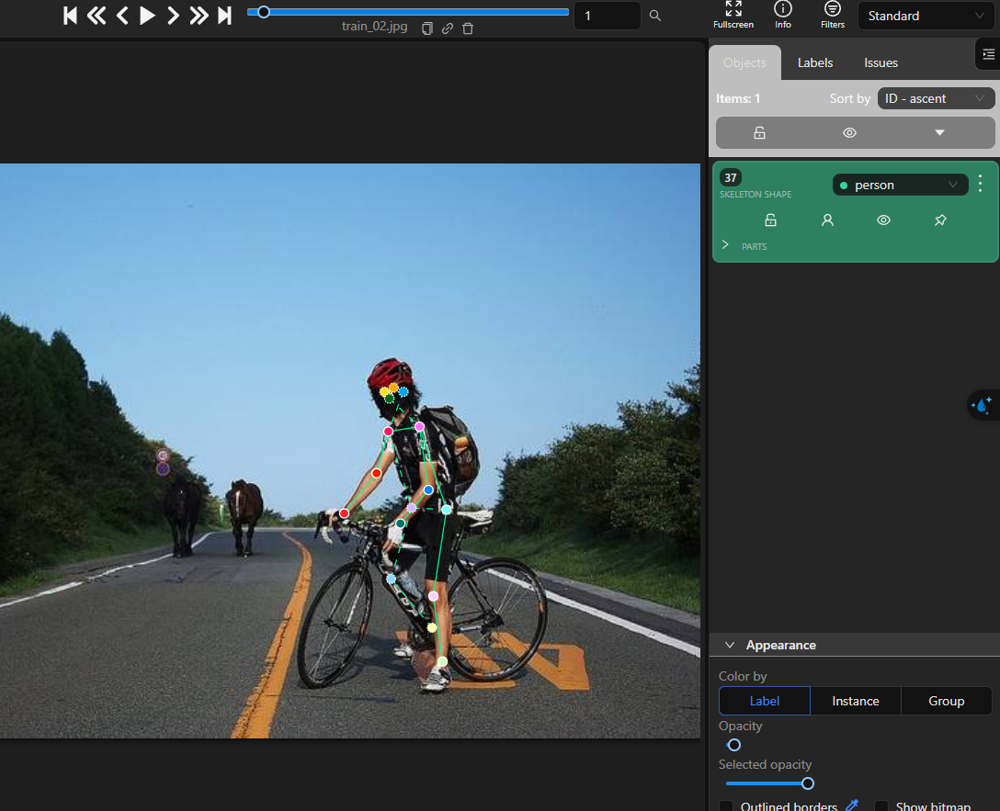
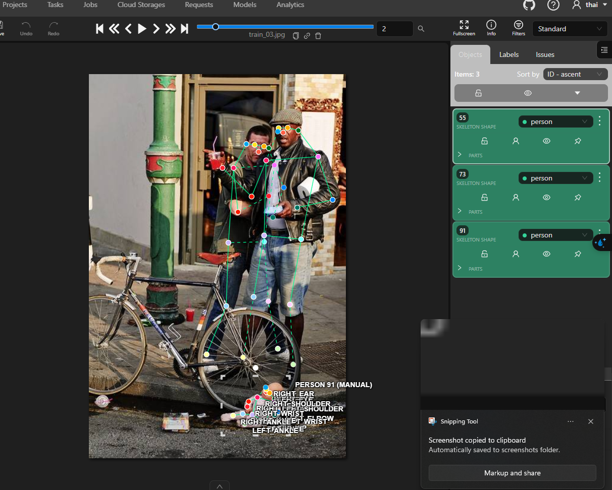

# Mini guideline - nhóm: Chưa cung cấp | người gán: Bùi Quang Thái | ngày: 2026-09-16

> File này được điền dựa trên luật của bài, kết quả self-check và các ảnh CVAT đã cung cấp.
> Phần kiểm chéo được ghi đúng thực tế: không thực hiện do giới hạn thời gian, không tạo reviewer giả.

## 1. Luật bắt buộc (đã thống nhất cả lớp - không sửa)

- Bộ 17 điểm COCO, đúng tên, đúng thứ tự. Lấy từ file `.SVG` chung.
- Mọi người trong ảnh đều có **đủ 17 điểm**. Điểm không dùng được thì gắn cờ, không xoá.
- Trái/phải tính theo **cơ thể người**, không theo bức ảnh.
- Bị che nhưng còn trong khung -> `v = 1`, **vẫn đặt chấm** ở vị trí ước lượng.
- Ra ngoài mép ảnh -> `v = 0`, **không** đặt chấm.
- Không dùng `Hidden` (`h`).

## 2. Luật áp dụng khi gán

| Tình huống | Luật đã dùng | Vì sao |
| --- | --- | --- |
| Hông của người mặc quần áo dài | Ước lượng vị trí giải phẫu. Nếu tâm hông không nhìn rõ nhưng khớp vẫn nằm trong frame thì đặt điểm ước lượng và dùng `v=1`. | Hông vẫn tồn tại trong khung hình, chỉ bị quần áo hoặc vật thể che. |
| Tai bị tóc hoặc mũ bảo hiểm che một phần | Nếu tai còn nằm trong frame nhưng tâm khớp không nhìn rõ, đặt điểm ước lượng và dùng `v=1`; chỉ dùng `v=2` khi nhìn rõ. | Phân biệt occluded với visible theo bằng chứng quan sát. |
| Người bị cắt ở mép ảnh | Khớp nào thực sự nằm ngoài biên ảnh thì dùng `v=0`; không kéo điểm vào vùng đen ngoài ảnh. | `v=0` chỉ dùng cho Outside. |
| Cổ tay nằm sau tay lái / sau thân mình | Nếu cổ tay vẫn nằm trong frame, suy ra theo cẳng tay/bàn tay, đặt điểm ước lượng và dùng `v=1`. | Bị che không đồng nghĩa với Outside. |
| Hai người chồng lên nhau | Hoàn thành từng skeleton riêng, bám theo phần cơ thể của đúng người; không nối điểm sang người khác. | Tránh lỗi `nham_nguoi`. |
| Người nhỏ đến mức nào thì không gán nữa | Với bộ core, vẫn gán người thật thuộc phạm vi bài nếu có thể xác định skeleton; không gán búp bê/đồ chơi như `person`. | Label `person` chỉ dành cho người thật trong dữ liệu. |

### Ảnh mẫu

**Người bị crop ở mép ảnh — `train_01`:**

**Hông/cổ tay bị che bởi xe và tư thế — `train_02`:**

**Hai người đứng chồng lấn — `train_03`:**

## 3. Ba ca mơ hồ đã gặp

### Ca 1 - ảnh `train_01`, người thứ `1`, khớp `left_knee`

- Mơ hồ ở chỗ nào: Phần thân dưới của người bị cắt bởi mép dưới ảnh nên không nhìn thấy đầu gối/cổ chân.
- Bạn quyết thế nào: Dùng `v=0` nếu khớp đã thực sự ra ngoài frame; không đặt điểm giả trong vùng đen.
- Vì sao: Đây là Outside thật, khác với trường hợp khớp bị vật che nhưng vẫn nằm trong ảnh.
- Nếu người khác quyết ngược lại thì model học sai cái gì: Dùng `v=1` sẽ dạy model rằng khớp vẫn nằm trong frame dù ảnh đã crop mất nó.

### Ca 2 - ảnh `train_02`, người thứ `1`, khớp `left_hip`

- Mơ hồ ở chỗ nào: Vùng hông bị tư thế ngồi xe, quần áo và xe đạp che nên không thấy rõ tâm khớp.
- Bạn quyết thế nào: Đặt điểm ở vị trí giải phẫu ước lượng và dùng `v=1` khi tâm khớp không nhìn rõ.
- Vì sao: Hông vẫn nằm trong frame và có thể suy ra từ vai, thân và đùi.
- Nếu người khác quyết ngược lại thì model học sai cái gì: Dùng `v=0` sẽ bỏ một keypoint vẫn tồn tại trong ảnh; dùng `v=2` khi không nhìn rõ làm visibility thiếu nhất quán.

### Ca 3 - ảnh `train_03`, người thứ `1`, khớp `left_wrist`

- Mơ hồ ở chỗ nào: Hai người đứng sát nhau, vùng tay/cổ tay của người phía sau bị người phía trước che một phần.
- Bạn quyết thế nào: Theo cẳng tay của đúng người để ước lượng cổ tay; nếu còn trong frame nhưng bị che thì dùng `v=1`.
- Vì sao: Điểm vẫn thuộc đúng người và còn trong ảnh, chỉ bị occlusion.
- Nếu người khác quyết ngược lại thì model học sai cái gì: Có thể tạo lỗi `nham_nguoi` hoặc kéo keypoint sang cơ thể người bên cạnh.

## 4. Sau khi so visibility report với bạn cùng nhóm

Không thực hiện kiểm chéo do giới hạn thời gian trước hạn nộp.

- Khớp lệch `%v=1` nhiều nhất: Không có dữ liệu so sánh peer review.
- Nguyên nhân là guideline chưa rõ hay một trong hai bên gán sai: Không kết luận do không có bài đối chiếu.
- Luật mới bổ sung sau khi thống nhất: Không có, vì không thực hiện peer review.

### Kết quả self-check thay thế

- `check_pose_labels.py`: đọc được 20/20 file nhãn, 29 skeleton, **ĐẠT định dạng**.
- `visualize_pose.py`: đã sinh overlay cho 29 skeleton.
- `visibility_report.py`: đã sinh báo cáo 20 ảnh.
